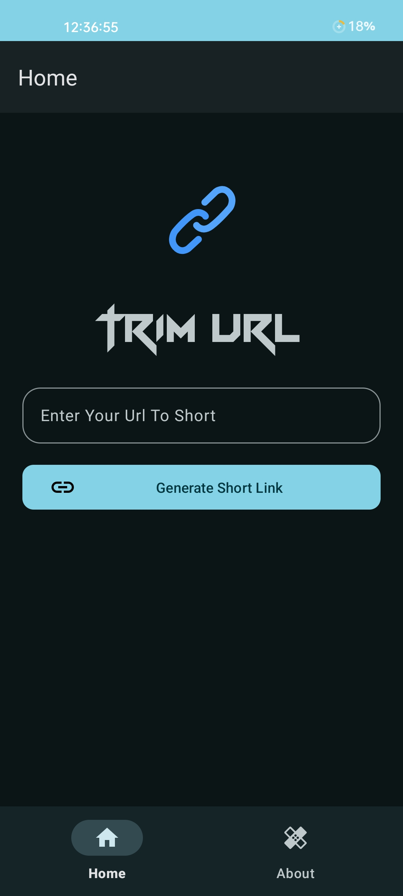
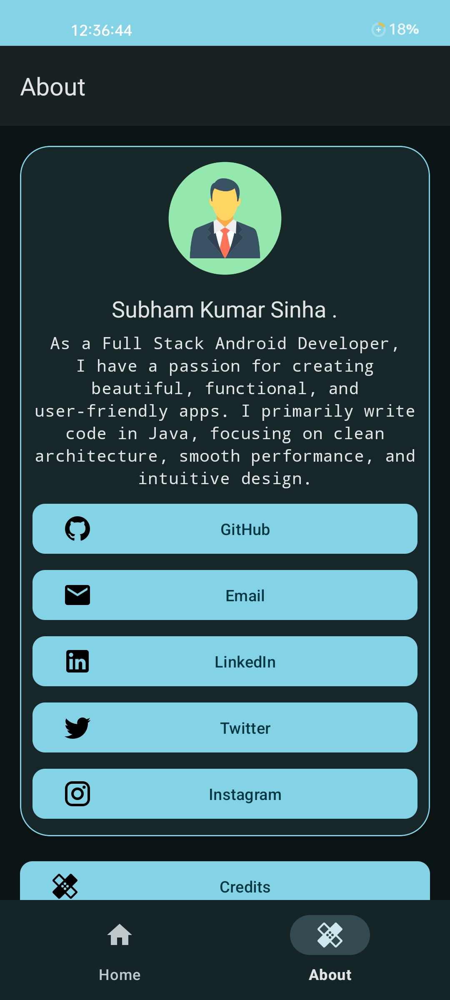
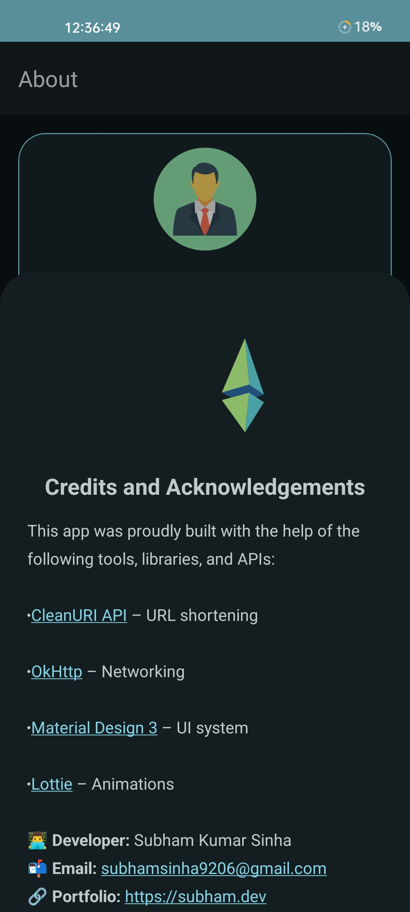

# ✂️ Trim URL - Android URL Shortener App

[](https://github.com/subhamsinhadev/trim-url/stargazers)
[](#)
[](https://cleanuri.com)
[](https://square.github.io/okhttp/)
[](https://airbnb.io/lottie/)

> 🚀 A lightweight and beautiful URL shortener Android app using [CleanURI API](https://cleanuri.com), powered by **OkHttp3**, styled with **Material Design 3 (MD3)**, and enhanced with **Lottie animations**.

---
“Make your links cleaner, faster, and shorter – with Trim URL.”

## 📱 Features

- 🔗 Convert long URLs into short ones using CleanURI API
- ⚡ Fast networking with OkHttp3
- 🎨 Sleek and modern UI with Material Design 3
- ✨ Smooth and fun Lottie animations
- 🌙 Light/Dark theme support
- 📋 Copy short URL to clipboard
- 📤 Share shortened URL with one tap

---

## 📸 Screenshots

<p align="center">
  
  
  
</p>

---

<h2 align="center">🎬 Demo</h2>

<p align="center">
  
</p>

---

## 🛠️ Tech Stack

| Technology      | Use Case                  |
|-----------------|---------------------------|
| **Java** | App Development           |
| **OkHttp3**     | Networking                |
| **CleanURI API**| URL Shortening Service    |
| **Material 3**  | UI Components & Theming   |
| **Lottie**      | Smooth Vector Animations  |

---
## 📦 Releases

Grab the latest release of Trim URL and try it out!

👉 **[Download APK](https://github.com/subhamsinhadev/trim-url/releases/download/Initial/Trim.URL.V1.0.apk)**  
📄 **[View All Releases](https://github.com/subhamsinhadev/trim-url/releases)**  
🆕 **Latest Version:** `v1.0.0`  
🗓️ **Released on:** June 25, 2025

---
## 🚀 Getting Started

1. **Clone the repository:**
   ```bash
   git clone https://github.com/subhamsinha/trim-url.git
Open in Android Studio

Build and Run on Emulator/Device

Enjoy trimming URLs!
❤️ Show Some Love
---
## 🧠 Learning Goals (for Developers)
📌 How to use OkHttp3 for REST APIs

📌 Implementing Lottie in Android

📌 Modern Material3 UI layout

## 🤝 Contributing
Contributions are what make the open-source community such an amazing place to learn, inspire, and create. Any contributions you make are greatly appreciated!

1.Fork the Project

2.Create your Feature Branch (git checkout -b feature/AmazingFeature)

3.Commit your Changes (git commit -m 'Add some AmazingFeature')

4.Push to the Branch (git push origin feature/AmazingFeature)

5.Open a Pull Request
## 🌟 Show your Support
If you like the project, consider leaving a ⭐️ to help others discover it!

1.⭐ Star this repository

2.🔁 Share it with your friends

3.🛠️ Fork and contribute to enhance it further!

## 📄 License
This project is licensed under the MIT License.
## 👨‍💻 Author

**Subham Kumar Sinha**  
📧 [LinkedIn](https://www.linkedin.com/in/subhamsinhadev)  


